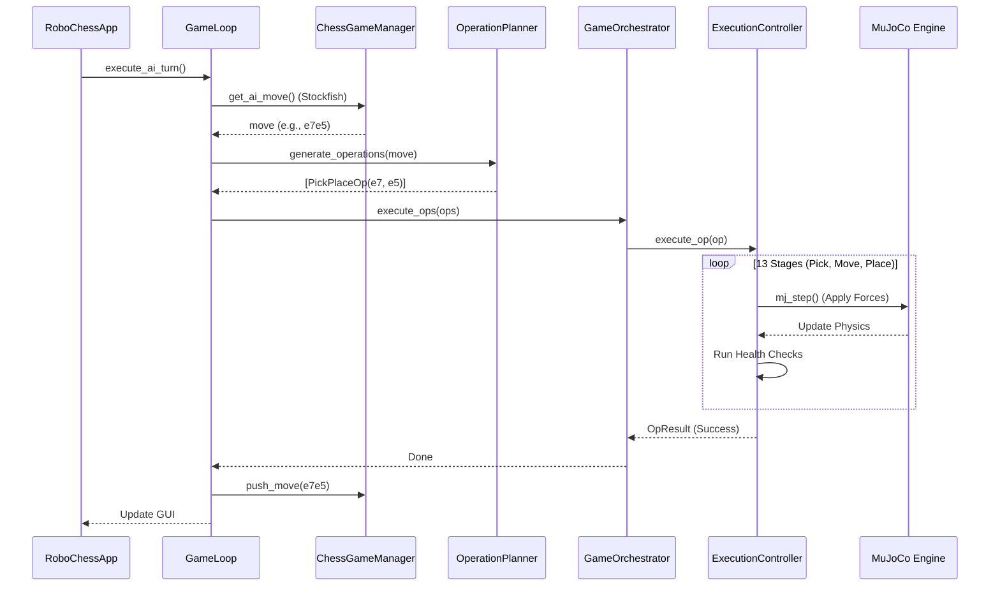

# 01 ARCHITECTURE: System Structure and Interactions

RoboChess follows a modular, layered architecture designed to separate high-level game logic from low-level physical control. This separation is crucial for debugging complex robotic interactions.

## 🏗️ Architectural Layers

### 1. Game Logic Layer (`src/logic/`)
- **`ChessGameManager`**: Powered by `python-chess`. It maintains the logical board state (FEN), validates legal moves, and interfaces with the **Stockfish** engine for AI decision-making.
- **`OperationPlanner`**: Translates a single chess move (e.g., "e2 to e4") into a list of physical **Operations** (`PickPlaceOp`). For example, a capture move involves two operations: moving the victim to the graveyard, then moving the attacker to the destination square.

### 2. Physical Orchestration Layer (`src/game_runtime.py`, `src/bootstrap.py`)
- **`SystemBootstrapper`**: The entry point for the simulation. It loads the MuJoCo XML scene, initializes the robot's "home" pose, and downloads the pretrained RL model.
- **`GameOrchestrator`**: The "conductor." It receives operations from the planner and dispatches them to the robot controller. It also handles **teleportation** logic for human moves or for pieces that are outside the robot's physical reach.

### 3. Robotic Control Layer (`src/control/`)
- **`ExecutionController`**: This is the heart of the robotic movement. It implements a **staged state machine** (13 stages total) to move the arm safely. It handles coordinate math (Cartesian to joint space) and manages the transition between scripted movements and RL-guided movements.

### 4. Physics Environment Layer (`src/env/`, `src/assets/`, `scripts/`)
-   **Scene Generation (`generate_xml.py`)**: Because a chessboard is geometrically dense, the main physics environment (`chess_world.xml`) is dynamically generated by a python script. It programmatically lays out 64 alternating square boxes, labels, and 32 pieces perfectly aligned to `src/config.py` scaling vectors. It then imports `fetch.xml` to inject the robotic body into the custom room.
-   **`ChessPickPlaceEnv`**: A customized Gymnasium-style environment. It acts as the bridge that steps the MuJoCo engine and exposes the simulation state to python variables.
-   **`ObservationReconstructor`**: Specialized logic that takes raw MuJoCo sensor outputs (joint angles, piece positions) and flattens them into the 26-dimensional mathematical vector expected by the RL policy.

## 🔄 Interaction Flow (The Lifecycle of a Move)

The following sequence diagram shows how the components interact when an AI move is triggered:

## 🛡️ Stability and Error Handling
Because MuJoCo is a rigid-body simulator, tiny errors can accumulate.
- **Runtime Checks**: At the end of every turn, the `RuntimeGuard` verifies that the physical position of every piece matches the logical board.
- **Freeze on Exception**: If a piece falls over or the robot fails a grasp, the simulation "freezes" (stops stepping physics but keeps the viewer open) so the developer can inspect the failure.
