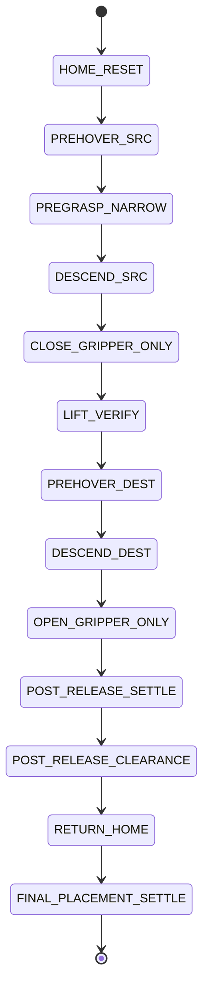

# 04 MOVEMENT STAGES: The Piece Manipulation Lifecycle

Moving a chess piece is complex because the robot must approach, grasp, lift, move, place, and release without tipping the piece or colliding with others. We use a **staged state machine** to manage this.

## 📐 The 13 Movement Stages

The `ExecutionController` breaks every move into these 13 discrete phases:

### Phase A: The Approach (Pick-up)
1.  **HOME_RESET**: Moves the arm to a neutral "waiting" position (`fetch_init_grip`).
2.  **PREHOVER_SRC**: Moves the gripper directly above the target piece at a safe height (`Z_SAFE`).
3.  **PREGRASP_NARROW**: Opens the gripper fingers just wide enough to fit around the piece (`pregrasp_gripper_opening`).
4.  **DESCEND_SRC**: Lowers the gripper onto the piece until it reaches `Z_GRASP`. Uses `grasp_descend_offset` to slow down the final approach.

### Phase B: The Grasp
5.  **CLOSE_GRIPPER_ONLY**: Squeezes the fingers to `gripper_closed`. This stage only returns success if the sensors detect contact within `grip_contact_tolerance`.
6.  **LIFT_VERIFY**: Lifts the piece a few centimeters. We check if the piece actually moved up with the arm within `piece_follow_tolerance` (verifying the grasp was successful).

### Phase C: The Transit (Move)
7.  **PREHOVER_DEST**: Moves the arm horizontally across the board to the target square remaining at `Z_SAFE`.
8.  **DESCEND_DEST**: Lowers the piece until it is pressed firmly against the destination square. We apply `close_descend_offset` (1-2mm) to guarantee physical pressure against the board.

### Phase D: The Release
9.  **OPEN_GRIPPER_ONLY**: Releases the fingers back to `gripper_open`. Checks status against `release_gripper_open_tolerance`.
10. **POST_RELEASE_SETTLE**: Waits `release_settle_steps` for any piece wobbling or vibration to dampen. Checks that velocity is below `release_velocity_tolerance`.
11. **POST_RELEASE_CLEARANCE**: Lifts the gripper straight up by `release_clearance_margin` to fully clear the piece's head without bumping it sideways.

### Phase E: Cleanup
12. **RETURN_HOME**: Returns the arm to its neutral position via `retract_steps`.
13. **FINAL_PLACEMENT_SETTLE**: The final check. We wait `final_settle_steps` for physics to fully stop and verify the piece is upright (via `tilt_threshold_cos`) and has not drifted from the center coordinate (via `displacement_threshold`).

## 📍 Why Stages?
Robotic movement in simulation is prone to "singularities" or sudden force spikes. By using stages, we can:
- **Isolate Errors**: If the move fails at `LIFT_VERIFY`, we know the problem was the grasp, not the path planning.
- **Dynamic Goals**: If a piece slips slightly during transit, the `DESCEND_DEST` stage can adjust its target coordinate in real-time to compensate.

## 📈 Visualizing the Machine

