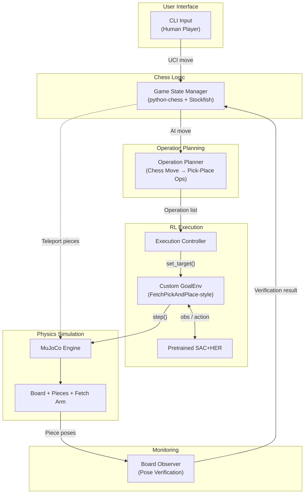
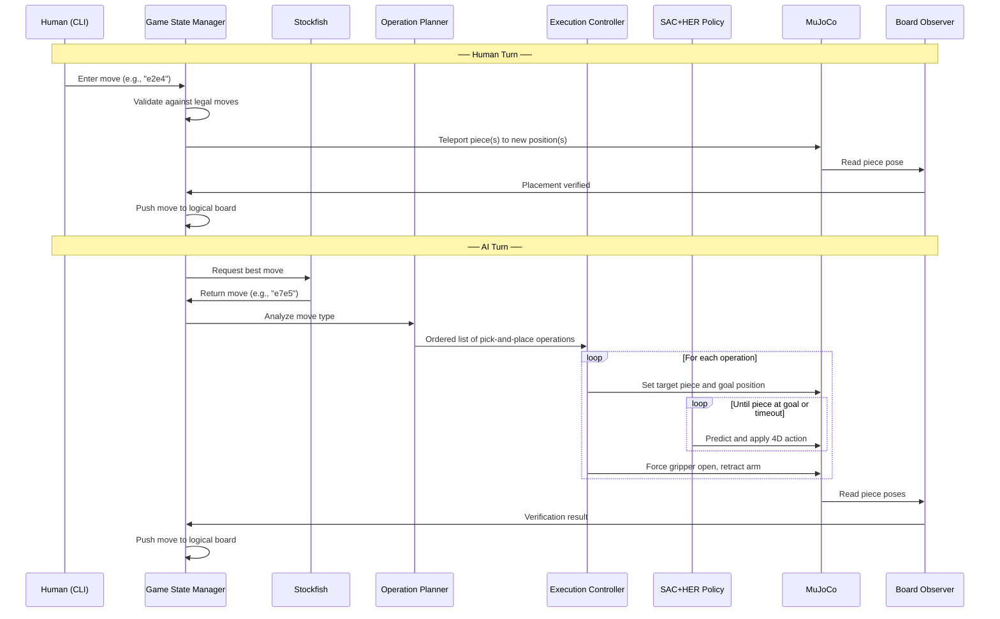

# RoboChess — High-Level Design

> **Course 20973** — Workshop in Autonomous Systems Simulation  
> **Project Track:** MuJoCo — Dexterous Robotic Arm for Object Manipulation  
> **Team Size:** 2

---

## 1. Project Overview

### 1.1 Motivation

Chess provides an ideal testbed for robotic manipulation: every move has a clear success criterion (piece placed correctly on the target square), the task naturally decomposes into independent subsystems (game logic, motion planning, control), and the variety of move types (standard, capture, castling, en passant, promotion) demands a robust and extensible architecture.

### 1.2 Project Description

**RoboChess** is a robotic chess simulation built in MuJoCo. A simulated Fetch robotic arm plays as the AI side of a chess game, physically picking up and placing pieces on the board. The arm is driven by a **pretrained reinforcement learning policy** (SAC + HER) originally trained on the `FetchPickAndPlace-v4` environment. The human opponent enters moves via a command-line interface, and their pieces are repositioned automatically through direct simulation state modification ("teleportation").

A chess engine (Stockfish) generates the AI's moves. The system validates every move through `python-chess`, plans the required physical operations, executes them with the RL policy, and verifies the outcome by reading piece positions from the simulation.

### 1.3 Core Objectives

| Objective | Description |
|---|---|
| **RL-based manipulation** | Demonstrate the use of a pretrained reinforcement learning policy for robotic pick-and-place |
| **Modular architecture** | Cleanly separate chess logic, operation planning, RL execution, and state verification |
| **Robustness** | Maintain synchronization between the logical board and the physical simulation; detect and handle manipulation failures |
| **Extensibility** | Support all standard chess move types, with room for future enhancements |

### 1.4 Design Decision: Single Arm + Teleportation

The project uses a single Fetch arm for the AI player rather than two arms (one per player). The human player's pieces are repositioned via direct state modification. This design decision was made for the following reasons:

1. **Policy compatibility** — The pretrained SAC+HER policy was trained on the Fetch arm. Using this specific arm avoids the morphology mismatch that would arise from using a different robot model (e.g., Franka Panda, UR5E). A policy trained on one arm cannot be transferred to a different arm without retraining.
2. **Reduced complexity** — A single-arm setup eliminates the need for dual-arm namespacing, inter-arm collision avoidance, and action routing logic.
3. **Focus on RL** — The project's core academic contribution is the RL-based manipulation. Simplifying the non-RL aspects allows more effort to be directed toward reliable pick-and-place execution.

---

## 2. System Architecture

The system is organized into five subsystems, each with a single responsibility:



### Subsystem Responsibilities

| Subsystem | Responsibility |
|---|---|
| **Game State Manager** | Owns the logical chess board (`python-chess`). Validates moves, queries Stockfish for AI moves, tracks turn order, detects game-ending conditions (checkmate, stalemate, draw). Handles human-move teleportation. |
| **Operation Planner** | Converts a validated chess move into an ordered list of pick-and-place operations. A standard move produces one operation; compound moves (captures, castling) produce two or more. |
| **Execution Controller** | Runs the RL policy in a loop for each operation until the piece reaches its goal or a timeout is exceeded. Handles post-placement scripting (gripper release, arm retraction). |
| **Custom GoalEnv** | Wraps the MuJoCo chess scene in a Gymnasium `GoalEnv` that matches the `FetchPickAndPlace-v4` observation and action interface. This is what allows the pretrained policy to operate in our custom scene. |
| **Board Observer** | After each move, reads piece positions and orientations from the simulation and compares them against expected values. Reports position error, tilt, and success/failure. |

---

## 3. Technology Stack

| Component | Technology | Justification |
|---|---|---|
| Physics engine | MuJoCo ≥ 3.1 | Industry-standard for contact-rich manipulation. Fast simulation, accurate contacts, built-in viewer. |
| Robot model | Fetch arm (from Gymnasium-Robotics) | Pretrained RL policies exist specifically for this arm on HuggingFace. Using the same arm avoids transfer-gap issues. |
| RL framework | Stable-Baselines3 (SAC + HerReplayBuffer) | The pretrained model (`FetchPickAndPlace-v4`) uses SAC+HER, a state-of-the-art off-policy algorithm for sparse-reward goal-conditioned tasks. |
| Environment wrapper | Custom `gymnasium.GoalEnv` | Required to present our chess scene to the pretrained policy with the exact observation format it was trained on. |
| Chess logic | `python-chess` ≥ 1.10 | Comprehensive chess library: legal move generation, special move detection, game-end conditions, UCI notation. |
| Chess engine | Stockfish ≥ 16 (binary) | Strongest open-source chess engine. Generates high-quality AI moves via the UCI protocol. Must be installed separately (not a pip package). A fallback to random legal moves is provided. |
| Visualization | `mujoco.viewer.launch_passive()` | Built-in 3D viewer with real-time rendering. No additional dependencies. |

---

## 4. Design Alternatives

### Alternative A: Pretrained RL Policy (Selected ✅)

Load a pretrained SAC+HER model from the `FetchPickAndPlace-v4` environment. Wrap the chess scene in a custom `GoalEnv` that matches the Fetch observation format. For each piece that needs to move, set the goal to the target square position and let the policy execute the full pick-and-place trajectory autonomously.

| Strengths | Weaknesses |
|---|---|
| Demonstrates reinforcement learning (core course requirement) | Policy may not generalize perfectly to chess pieces (different shape/mass than the training block) |
| End-to-end pick-and-place learned from experience | Black-box behavior is harder to debug |
| No manual trajectory or controller design needed | Cluttered board with 32 pieces is a more complex scene than training |
| If performance is insufficient, the model can be fine-tuned on the chess environment | Dependent on the Fetch arm specifically |

### Alternative B: Inverse Kinematics / Operational Space Control

Use analytic inverse kinematics (damped least-squares Jacobian pseudoinverse) to generate joint-level commands that drive the end-effector along a sequence of scripted waypoints (hover → descend → grasp → lift → transit → descend → release → retreat).

| Strengths | Weaknesses |
|---|---|
| Deterministic — same inputs always produce the same output | Does not demonstrate reinforcement learning |
| Compatible with any robot arm model | Requires manual gain tuning (damping, step size) |
| Easier to debug individual waypoint failures | Individual waypoints must be designed and sequenced by hand |
| Full control over the trajectory at every step | Less academically interesting for an RL-focused course |

### Decision Rationale

**Alternative A** was selected because the course description specifies that the project should demonstrate "reinforcement learning, or a pretrained algorithm." A pretrained RL policy satisfies this requirement directly. Alternative B (IK/OSC) is retained as a documented **fallback strategy** in case the pretrained model proves unreliable. The fallback ladder is:

1. Pretrained SAC+HER (no additional training)
2. Fine-tune the pretrained model on the chess environment
3. Train SAC+HER from scratch on the chess environment
4. Fall back to IK/OSC (last resort)

### Key Architectural Principle: Operations, Not Waypoints

An important design principle follows from the choice of a pretrained RL policy. The FetchPickAndPlace policy was trained to perform the **complete pick-and-place sequence** end-to-end: it learns when to approach, grasp, lift, transit, and place. The system must not decompose moves into low-level sub-waypoints (hover, descend, grasp), as this would break the policy's assumptions about the task structure. Instead, each chess move is decomposed into one or more high-level **operations**, where each operation is a complete pick-and-place task defined by (piece to pick, position to place).

---

## 5. Simulation Scene

### 5.1 Layout

```
    ┌────────────────────────────────────┐
    │          MuJoCo World              │
    │                                    │
    │  ┌──────────┐   ┌──────────┐      │
    │  │White      │   │Black     │      │
    │  │Graveyard  │   │Graveyard │      │
    │  │ (4×4)     │   │ (4×4)    │      │
    │  └──────────┘   └──────────┘      │
    │                                    │
    │       ┌──────────────┐             │
    │       │              │             │
    │       │  CHESSBOARD  │  FETCH ARM  │
    │       │   8×8 grid   │             │
    │       │   (40×40 cm) │             │
    │       └──────────────┘             │
    │                                    │
    └────────────────────────────────────┘
```

### 5.2 Scene Construction

The scene is constructed by extending the existing FetchPickAndPlace MJCF (MuJoCo XML) from the Gymnasium-Robotics library. This approach preserves the exact robot model, actuator definitions, and physical parameters that the pretrained policy was trained with. The modifications are:

1. **Remove** the single training block body
2. **Add** 64 alternating-color square tile geoms for the chessboard, using warm ivory and walnut tones plus a wood border
3. **Add** 32 chess piece bodies with freejoints (one per piece in the initial position)
4. **Add** 8 spare piece bodies (4 per color, hidden below the table) for pawn promotion
5. **Add** visual markers for the two graveyard zones (4×4 grids) on the far side of the board from the robot arm
6. **Disable** scene shadows so the arm does not cast across the board during play

### 5.3 Chess Pieces

Pieces use refined Staunton-style STL meshes for visuals, while manipulation still relies on hidden box collision geoms for stable contact behavior.

| Piece | Height | Diameter | Mass |
|---|---|---|---|
| Pawn | 3.0 cm | 2.0 cm | 20 g |
| Rook | 3.5 cm | 2.4 cm | 25 g |
| Knight | 4.0 cm | 2.4 cm | 25 g |
| Bishop | 4.5 cm | 2.2 cm | 25 g |
| Queen | 5.0 cm | 2.6 cm | 30 g |
| King | 5.5 cm | 2.6 cm | 30 g |

Each piece body has `condim="4"` contacts (tangential + torsional friction), tuned friction coefficients, and joint damping to prevent unrealistic sliding or toppling.

### 5.4 Piece Naming Convention

Each piece body in MuJoCo follows the pattern `{color}_{type}_{number}`:
- `w_pawn_1` through `w_pawn_8`, `b_rook_1`, `b_queen`, etc.
- Spare bodies: `w_spare_queen`, `b_spare_knight`, etc.
- Total: 40 bodies (32 game + 8 spares)

---

## 6. Game Flow

### 6.1 Turn Sequence



### 6.2 Human Move Execution

Human moves are executed by directly modifying the simulation state: the piece body's position is set to the target square coordinates, its orientation is reset to upright, and its velocity is zeroed. This approach is instantaneous and always succeeds, avoiding the need for a second robotic arm. For compound human moves (captures, castling), all involved pieces are repositioned atomically.

### 6.3 AI Move Execution

AI moves are decomposed into pick-and-place operations by the Operation Planner. Each operation is then executed by the Execution Controller, which:

1. Sets the target piece and goal position in the GoalEnv
2. Runs the RL policy in a loop (policy outputs 4D actions: Δx, Δy, Δz, gripper)
3. Monitors convergence: the operation succeeds when the piece is within 8 mm of the goal
4. On success, forces the gripper open and retracts the arm before the next operation
5. On timeout, retries once; if the retry fails, logs the failure

---

## 7. The RL Integration

### 7.1 How the Pretrained Policy Works

The `FetchPickAndPlace-v4` policy was trained using SAC (Soft Actor-Critic) with HER (Hindsight Experience Replay) to perform end-to-end pick-and-place. Given an observation of the gripper state and an object, plus a desired goal position, the policy has learned to:
- Navigate the end-effector to the object
- Grasp it with the two-finger gripper
- Lift and transport it to the goal
- Place it at the target position

The policy controls all 4 action dimensions (3D end-effector displacement + gripper open/close) and handles the complete manipulation trajectory autonomously.

### 7.2 The Custom GoalEnv Wrapper

To use this pretrained policy in our chess scene, we wrap the modified MuJoCo scene in a custom `GoalEnv` that presents the **exact same observation interface** as the original training environment:

| Field | Shape | Content |
|---|---|---|
| `observation` | (25,) | Gripper position, object position, relative position, finger joint positions, orientations, velocities |
| `achieved_goal` | (3,) | Current XYZ position of the target chess piece |
| `desired_goal` | (3,) | Target XYZ position (the square where the piece should be placed) |
| `action` | (4,) | End-effector displacement (dx, dy, dz) + gripper command |

The 25-dimensional observation vector must exactly match the layout used during training. Any mismatch would produce incorrect policy behavior.

### 7.3 Fallback Strategy

If the pretrained policy does not perform reliably on chess pieces (which differ in shape and mass from the training block), the following fallback measures are available in order of increasing effort:

1. **Tune piece physics** — adjust mass, friction, and dimensions to better match the training block
2. **Fine-tune the model** — run additional SAC+HER training on the chess environment
3. **Train from scratch** — use the same SAC+HER algorithm but train a new model on the chess scene
4. **IK/OSC fallback** — switch to deterministic inverse kinematics control (Alternative B)

---

## 8. Special Move Handling

Each chess move type requires a different sequence of physical operations:

| Move Type | Detection Method | Operations for AI | Teleportation for Human |
|---|---|---|---|
| **Standard move** | Default | 1 op: pick piece → destination square | Teleport piece |
| **Capture** | `board.is_capture()` | 2 ops: (1) pick captured piece → graveyard, (2) pick attacker → destination | Teleport both |
| **Kingside / Queenside Castling** | `board.is_castling()` | 2 ops: (1) pick king → king's destination, (2) pick rook → rook's destination | Teleport both |
| **En passant** | `board.is_en_passant()` | 2 ops: (1) pick captured pawn from adjacent square → graveyard, (2) pick attacker → destination | Teleport both |
| **Pawn promotion** | `move.promotion is not None` | 1 op: pick pawn → promotion square. Then: teleport pawn to graveyard, teleport spare piece of promoted type to the square | Teleport + swap |

**Promotion handling:** The scene includes 4 spare piece bodies per color (queen, rook, bishop, knight) hidden below the table. On promotion, the pawn is teleported to the graveyard and the appropriate spare body is teleported to the promotion square.

---

## 9. Key Performance Indicators

| KPI | Target | How Measured |
|---|---|---|
| **Move success rate** | ≥ 90% | Board observer verification after each AI move |
| **Position accuracy** | ≤ 8 mm error | Euclidean distance between piece position and square center |
| **Orientation stability** | Tilt < 15° | Quaternion-to-Euler conversion; check roll/pitch |
| **Move execution time** | < 20 s (simulation time) | Timer per pick-and-place operation |
| **Board state synchronization** | 100% | Full board scan comparing all physical piece positions against the logical board each turn |
| **Game completion** | Full game without crash | End-to-end test using Scholar's Mate (4-move checkmate) |

---

## 10. Risks and Mitigations

| Risk | Impact | Mitigation |
|---|---|---|
| Pretrained policy cannot reliably grasp cylindrical chess pieces | High | Tune piece dimensions to match training block. Fine-tune model. IK/OSC fallback. |
| Fetch arm cannot reach all 64 board squares | High | Pre-validate reachability at startup. Adjust board placement within arm workspace. |
| Arm collides with neighboring pieces during transit | Medium | Tune board spacing. Monitor collision count via `mj_data.ncon`. Accept as known risk of cluttered scenes. |
| Policy does not release piece after placing | Medium | Force gripper open when piece reaches goal position. |
| Stockfish binary not installed | Low | Graceful fallback to random legal moves with a warning. |
| Draw conditions cause infinite game loop | Low | Use `board.is_game_over(claim_draw=True)` to detect threefold repetition, fifty-move rule, and insufficient material. |
| Promotion with no available spare body | Low | Pre-allocate 4 spare bodies per color. Only 1 promotion per piece type is common; edge cases with multiple promotions are extremely rare. |

---

## 11. Simulation Scenarios

| # | Scenario | What It Tests |
|---|---|---|
| 1 | Single pick-and-place | RL policy can grasp and relocate one chess piece |
| 2 | Italian Game opening (4 moves) | Standard moves, turn switching, repeated operations |
| 3 | Capture sequence | Multi-operation compound moves, graveyard routing |
| 4 | Kingside castling | Two-operation sequence (king + rook) |
| 5 | En passant | Capture from a non-destination square |
| 6 | Pawn promotion | Piece body swap mechanics |
| 7 | Scholar's Mate (4-move checkmate) | Full end-to-end game |
| 8 | Failed grasp recovery | Error detection and retry mechanism |

---

## 12. Course Requirement Alignment

| Requirement | How Satisfied |
|---|---|
| MuJoCo simulation | Entire project runs in MuJoCo |
| Reinforcement learning or pretrained algorithm | Pretrained SAC+HER policy from `FetchPickAndPlace-v4` |
| SOLID design principles | Five subsystems, each with a single responsibility; dependency injection; clear interfaces |
| Design alternatives analysis | Section 4: RL vs. IK/OSC with trade-off tables |
| Architecture diagram | Section 2: component diagram |
| Sequence diagram | Section 6: turn sequence diagram |
| KPIs with measurable targets | Section 9 |
| Risk analysis | Section 10 |
| Simulation scenarios | Section 11 |

---

## 13. Future Extensions

1. **Fine-tuned RL policy** — train specifically on the chess environment for higher grasp reliability
2. **Dual-arm setup** — add a second Fetch arm for the human player using `dm_control` PyMJCF `attach()`
3. **Realistic piece meshes** — import Staunton-style STL models
4. **Vision-based state estimation** — infer board state from rendered images instead of reading simulation state
5. **Graphical user interface** — replace the CLI with a visual chess board
6. **Configurable difficulty** — expose Stockfish skill level and time controls
7. **Game replay** — record and replay games with visualization
