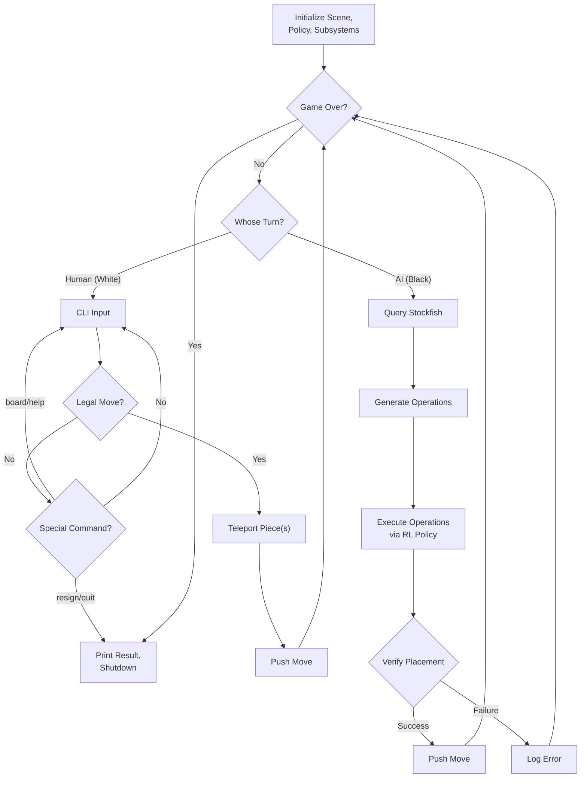
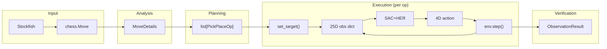

# RoboChess — Low-Level Design

> **Companion to:** [High-Level Design](file:///C:/Users/yuval_88/.gemini/antigravity/brain/3c120a96-db08-486d-9f8d-aaf5aa9d9bdc/high_level_design.md)

---

## 1. Project Structure

```text
scripts/
├── generate_xml.py                 # MJCF scene generator
├── verify_mujoco.py               # Scene-load sanity check
└── headless_run.py                # Single-operation smoke test
src/
├── assets/
│   ├── chess_world.xml              # Modified FetchPickAndPlace MJCF scene
│   ├── fetch/                       # Fetch arm XML files (from Gymnasium-Robotics)
│   └── chess_*.stl                  # Visual chess-piece meshes
├── env/
│   ├── __init__.py
│   └── chess_pick_place_env.py      # Custom GoalEnv wrapper
├── logic/
│   ├── __init__.py
│   ├── chess_manager.py             # Game state, Stockfish interface, teleportation
│   └── operation_planner.py         # Chess move → pick-and-place operations
├── control/
│   ├── __init__.py
│   └── execution_controller.py      # RL policy loop + post-operation scripting
├── observation/
│   ├── __init__.py
│   └── board_observer.py            # Post-move pose verification
├── config.py                        # YAML-backed runtime constants and paths
requirements.txt
main.py                              # Main game loop orchestrator
```

Each directory represents one subsystem from the high-level architecture. The `assets/` directory contains the MuJoCo scene definition, while the four Python packages (`env/`, `logic/`, `control/`, `observation/`) correspond to the RL execution, chess logic, execution control, and monitoring subsystems respectively.

---

## 2. Configuration

All tunable parameters are centralized in `config.py` to avoid magic numbers and simplify experimentation. The key configuration groups are:

| Group | Parameters | Notes |
|---|---|---|
| **Paths** | Scene XML path, Stockfish binary path, pretrained model path | Model path can be a HuggingFace ID or local `.zip` file |
| **Board geometry** | Board center position, square size (5 cm), table height, grasp height | All positions in MuJoCo world coordinates |
| **Graveyard** | Origin positions, grid dimensions (4×4), spacing | Must be within arm reach for AI captures |
| **RL control** | Goal tolerance (8 mm), max steps per operation (500), post-place steps, retract steps | Tolerance matches FetchPickAndPlace training |
| **Piece physics** | Friction coefficients, damping, contact dimensionality (`condim=4`) | Tuned for stable grasping |
| **Stockfish** | Time limit per move, enable/disable flag | Fallback to random moves when disabled |

---

## 3. Scene Construction

### 3.1 Approach

The MuJoCo scene is built by **extending the existing FetchPickAndPlace MJCF** from the Gymnasium-Robotics library. This approach ensures that the robot model, actuator definitions, sensor sites, and physical parameters remain identical to those used during RL training.

The modifications made to the original scene are:
1. Remove the single training block body
2. Add 64 flat box geoms in an 8×8 grid with alternating ivory/walnut colors and a thin wood border
3. Add 32 chess piece bodies at their initial positions on the board
4. Add 8 spare piece bodies (for pawn promotion), initially hidden below the table
5. Add raised graveyard trays on the far side of the board from the robot arm
6. Disable shadows to keep the board readable during play

### 3.2 Chess Piece Bodies

Each chess piece is a MuJoCo body with:
- A **freejoint** allowing unconstrained 6-DoF movement
- A **visual STL mesh** for appearance
- A hidden **box collision geom** that preserves robust grasp/contact behavior
- Joint damping to prevent unrealistic sliding

### 3.3 Naming Convention

Pieces follow the pattern `{color_initial}_{type}_{number}`:
- Game pieces: `w_pawn_1` through `w_pawn_8`, `b_rook_1`, `w_queen`, etc.
- Spare pieces: `w_spare_queen`, `b_spare_rook`, etc.

### 3.4 Coordinate System

A utility function converts chess notation (e.g., `"e4"`) to MuJoCo world coordinates. Square `a1` maps to the bottom-left corner from White's perspective. The board is positioned within the Fetch arm's workspace (~1 m reach), with all 64 squares and both graveyard zones reachable.

---

## 4. Module Specifications

### 4.1 Custom GoalEnv (`env/chess_pick_place_env.py`)

**Class: `ChessPickPlaceEnv`** — inherits from `gymnasium.GoalEnv`

This is the most critical module in the system. It wraps the MuJoCo chess scene so that the pretrained FetchPickAndPlace policy can operate in it. The wrapper must reconstruct the exact 25-dimensional observation vector that the policy was trained on.

**Observation structure (25D):**

| Indices | Content | Source |
|---|---|---|
| 0–2 | Gripper position (XYZ) | End-effector site position |
| 3–5 | Object position (XYZ) | Target chess piece body position |
| 6–8 | Object position relative to gripper | Computed: object − gripper |
| 9–10 | Gripper finger joint positions | Two finger joint `qpos` values |
| 11–13 | Object orientation (Euler angles) | Quaternion → Euler conversion |
| 14–16 | Object linear velocity | Body linear velocity |
| 17–19 | Object angular velocity | Body angular velocity |
| 20–22 | Gripper linear velocity | End-effector site velocity |
| 23–24 | Gripper finger joint velocities | Two finger joint `qvel` values |

**Key interface:**

| Method | Description |
|---|---|
| `set_target(piece_name, goal_pos)` | Configure which chess piece is the current "object" and where it should be placed |
| `step(action)` | Apply the 4D action to the Fetch arm, step physics, return observation dict |
| `compute_reward(achieved, desired, info)` | Sparse: 0 if object within tolerance of goal, −1 otherwise |
| `force_gripper_open()` | Override gripper actuators to the open position (used post-placement) |

---

### 4.2 Operation Planner (`logic/operation_planner.py`)

**Dataclass: `PickPlaceOp`** — represents one complete pick-and-place task

| Field | Type | Description |
|---|---|---|
| `piece_name` | `str` | MuJoCo body name of the piece to pick up |
| `goal_pos` | `ndarray(3)` | World position where the piece should be placed |
| `label` | `str` | Human-readable description for logging |

**Class: `OperationPlanner`**

Converts a validated chess move into an ordered list of `PickPlaceOp` instances. The planner dispatches based on move type:

| Move Type | Operations Generated |
|---|---|
| Standard move | 1 operation: pick piece → destination |
| Capture | 2 operations: (1) captured piece → graveyard, (2) attacker → destination |
| Castling | 2 operations: (1) king → new position, (2) rook → new position |
| En passant | 2 operations: (1) captured pawn → graveyard, (2) attacker → destination |
| Promotion | 1 operation: pawn → destination. Piece swap handled post-execution via teleportation |

---

### 4.3 Execution Controller (`control/execution_controller.py`)

**Dataclass: `OpResult`** — outcome of one operation

| Field | Type | Description |
|---|---|---|
| `success` | `bool` | Whether the piece reached the goal within tolerance |
| `steps_taken` | `int` | Simulation steps used |
| `final_error_mm` | `float` | Final position error in millimeters |

**Class: `ExecutionController`**

Executes a single `PickPlaceOp` by running the RL policy in a loop:

1. Set the target piece and goal in the GoalEnv
2. Loop up to `MAX_STEPS_PER_OP` steps:
   - Call `policy.predict()` to get a 4D action
   - Call `env.step()` to apply it
   - Check if the piece has reached the goal
3. On success: force gripper open, let the scene settle for `POST_PLACE_STEPS`
4. On timeout: return failure result
5. After each operation: retract arm upward (scripted motion) to clear the board

The controller does **not** override the policy's gripper command during execution — the policy controls all 4 action dimensions. The gripper is only force-opened post-placement to ensure the piece is released.

---

### 4.4 Chess Manager (`logic/chess_manager.py`)

**Dataclass: `MoveDetails`** — analysis of a chess move before execution

| Field | Description |
|---|---|
| `from_square`, `to_square` | Source and destination squares (e.g., `"e2"`, `"e4"`) |
| `is_capture`, `captured_square`, `captured_piece_name` | Capture information |
| `is_castling`, `rook_from`, `rook_to` | Castling rook movement |
| `is_en_passant` | En passant flag |
| `is_promotion`, `promotion_piece_type` | Promotion information |

**Class: `ChessGameManager`**

| Responsibility | Key Methods |
|---|---|
| Maintain logical board state | Wraps `chess.Board` from `python-chess` |
| Validate human moves | `validate_human_move(uci)` — checks against legal moves |
| Generate AI moves | `get_ai_move()` — queries Stockfish via UCI, falls back to random |
| Analyze move type | `get_move_details(move)` — returns `MoveDetails` before pushing |
| Teleport pieces (human moves) | `teleport_piece(name, pos)` — sets body position/orientation/velocity directly |
| Execute human moves atomically | `execute_human_move(details)` — teleports all pieces and updates mapping |
| Handle promotion | `_handle_promotion()` — swaps pawn body with spare piece body |
| Track square→piece mapping | `square_to_piece` dictionary, updated on every move |
| Detect game end | `is_game_over()` — checkmate, stalemate, draw (threefold, 50-move, insufficient material) |

**Important:** `get_move_details()` must be called **before** `push_move()`, because it needs the pre-move board state to correctly identify captures, en passant targets, and castling rook positions.

---

### 4.5 Board Observer (`observation/board_observer.py`)

**Dataclass: `ObservationResult`**

| Field | Description |
|---|---|
| `success` | Position within tolerance and piece upright |
| `position_error_mm` | Euclidean distance from expected position |
| `tilt_degrees` | Piece tilt from vertical |
| `details` | Human-readable summary |

**Class: `BoardObserver`**

| Method | Description |
|---|---|
| `verify_piece(name, expected_pos)` | Check one piece's position and orientation |
| `full_board_scan(square_to_piece)` | Verify all piece positions against the logical board |
| `is_upright(name)` | Check if tilt < 15° using quaternion-to-Euler conversion |
| `get_pos(name)` | Read body position from MuJoCo state |

---

## 5. Main Game Loop (`main.py`)

The main loop orchestrates all subsystems. The flow is:

1. **Initialization:** Load the MuJoCo scene, create the GoalEnv, load the pretrained policy, initialize the game manager, planner, observer, and execution controller. Launch the viewer.

2. **Game loop** (until `game.is_game_over()`):

   **If human turn:**
   - Read input from CLI (supports UCI moves and commands: `resign`, `quit`, `board`, `help`)
   - Validate the move
   - Analyze move details
   - Execute via teleportation (atomic mapping update)
   - Push to logical board

   **If AI turn:**
   - Query Stockfish for the best move
   - Analyze move details
   - Generate operations via the Operation Planner
   - Execute each operation via the Execution Controller (RL policy loop)
   - On failure: retry once per operation
   - If promotion: swap piece bodies post-execution
   - Update square-to-piece mapping
   - Verify placement via the Board Observer
   - Push to logical board

3. **Shutdown:** Print game result, close Stockfish engine, close viewer.

### Main Loop Flowchart



---

## 6. Data Flow

The following diagram shows how data flows through the system for a single AI move:



---

## 7. Error Handling Strategy

| Failure Scenario | Detection | Response |
|---|---|---|
| **RL policy does not reach goal** | Operation exceeds `MAX_STEPS_PER_OP` | Retry once. Log failure with step count and final error. |
| **Piece dropped during transport** | `verify_piece()` reports error > tolerance | Log failure. Attempt a new pick-and-place operation. |
| **Piece tipped over** | `is_upright()` returns `False` | Log degraded KPI. Accept if horizontal position is correct. |
| **Board state desynchronization** | `full_board_scan()` finds mismatches | Halt the game. Log comprehensive error report. |
| **Stockfish process crash** | Python exception from `engine.play()` | Fall back to random legal moves for the remainder of the game. |
| **Invalid human input** | `validate_human_move()` returns `None` | Print error message, re-prompt. No physical action taken. |
| **Promotion: spare body unavailable** | Spare already used in a previous promotion | Log error. Degrade gracefully (keep pawn body at promotion square). |

---

## 8. Dependencies

### Python Packages

| Package | Version | Purpose |
|---|---|---|
| `mujoco` | ≥ 3.1.0 | Physics simulation |
| `gymnasium` | ≥ 0.29.0 | GoalEnv base class |
| `gymnasium-robotics` | ≥ 1.2.0 | Fetch arm assets and reference environment |
| `stable-baselines3` | ≥ 2.1.0 | Load and run pretrained SAC+HER model |
| `huggingface-sb3` | ≥ 3.0 | Download pretrained model from HuggingFace Hub |
| `python-chess` | ≥ 1.10.0 | Chess logic and UCI protocol |
| `numpy` | ≥ 1.24.0 | Numerical computation |

### External Dependencies

**Stockfish** — the chess engine must be installed separately as a system binary. It is not a Python package.
- Windows: download from https://stockfishchess.org/download/
- macOS: `brew install stockfish`
- Linux: `sudo apt install stockfish`

The path to the Stockfish binary is configured in `config.py`.

---

## 9. Milestone Plan

| Milestone | Deliverable | Target Weeks |
|---|---|---|
| **M1 — Scene** | MuJoCo scene loads and renders: chessboard, all pieces, Fetch arm | 2–3 |
| **M2 — GoalEnv** | Custom GoalEnv wrapper passes observation-format tests; pretrained policy moves arm to a target position | 3–4 |
| **M3 — Pick-and-Place** | RL policy successfully grasps one chess piece and places it at a new square | 4–5 |
| **M4 — Chess Logic** | Full game state manager with Stockfish integration, human CLI, and teleportation | 5–6 |
| **M5 — Standard Moves** | Operation planner + execution controller handle standard moves end-to-end | 6–7 |
| **M6 — Special Moves** | Captures, castling, en passant, and promotion all functional | 7–8 |
| **M7 — Monitoring** | Board observer, KPI logging, error detection, retry mechanism | 8–9 |
| **M8 — Integration** | Full end-to-end chess game (Scholar's Mate). Documentation and polish. | 9–11 |
