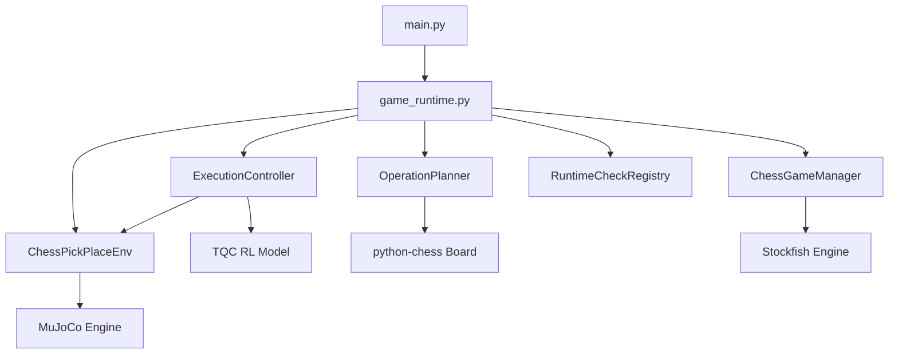

# RoboChess — Deep Analysis & Implementation Plan

## 1. Project Architecture Summary

RoboChess is a physics-based chess game where a **Fetch robotic arm** (controlled by a pretrained TQC RL policy) physically moves chess pieces on a MuJoCo-simulated board. The human plays White (pieces teleported), the AI plays Black (pieces physically manipulated by the arm).



**Key layers:**
- **Scene generation**: [generate_xml.py](file:///home/user/projects/robo_chess_2/scripts/generate_xml.py) + [generate_chess_piece_meshes.py](file:///home/user/projects/robo_chess_2/scripts/generate_chess_piece_meshes.py)
- **Environment bridge**: [chess_pick_place_env.py](file:///home/user/projects/robo_chess_2/src/env/chess_pick_place_env.py) — Gym wrapper matching FetchPickAndPlace
- **Staged controller**: [execution_controller.py](file:///home/user/projects/robo_chess_2/src/control/execution_controller.py) — 13-stage pick-and-place pipeline
- **Config**: [runtime.yaml](file:///home/user/projects/robo_chess_2/src/settings/runtime.yaml) → [config.py](file:///home/user/projects/robo_chess_2/src/config.py)

---

## 2. Analysis Results

### 2.1 Scene Analysis (MuJoCo XML)

#### Board & Table Collision — 🔴 CRITICAL BUG

The **root cause** of the failures in logs7 and logs8 is identified here:

| Geom              | Collision Enabled? | Size Z (half) | Notes                        |
| ----------------- | ------------------ | ------------- | ---------------------------- |
| `table`           | ❌ `contype="0"`    | 0.2           | **Table has NO collisions!** |
| `board_collision` | ✅ (default)        | **0.0005**    | Only **1mm thick**           |
| `board_underlay`  | ❌ `contype="0"`    | 0.0007        | Visual only                  |
| `board_frame_*`   | ❌ `contype="0"`    | 0.003         | Visual only                  |
| `square_*`        | ❌ `contype="0"`    | 0.0005        | Visual only                  |

> [!CAUTION]
> The board collision geometry is **1mm thick** — the thinnest slab in the entire scene. When a piece descends with any momentum, MuJoCo's contact solver can fail to catch such a thin collision shell, allowing the piece to tunnel straight through. **This is the primary failure mode.**

The MuJoCo floor plane from `shared.xml` is never generated — there is **no global floor** either. Once a piece tunnels through the 1mm board, it falls to negative Z indefinitely.

#### Piece Construction

Each chess piece body has:
1. A **visual mesh geom** (`contype="2" conaffinity="2"`, mass=0) — for rendering
2. A **cylinder hitbox** (`contype="1" conaffinity="1"`, condim=3, mass=0.05) — for gripper interaction
3. A free joint with `damping="0.05"`
4. Spawn Z = `Z_GRASP + 0.0006` = 0.4136

> [!IMPORTANT]
> **Contact group mismatch**: The piece hitbox (contype=1/conaffinity=1) contacts the board_collision (default contype=1/conaffinity=1) ✅. But the piece mesh (contype=2/conaffinity=2) only interacts with the gripper fingers (contype=2/conaffinity=2 from `fetchGripper` class). This is intentional — the cylinder is the physics proxy.

#### Piece Stability Concerns
- Piece mass = 50g → very light for 12mm radius × 24mm tall cylinder
- Piece COM is at the body origin (cylinder center), not at the mesh visual center
- The mesh `pos="0 0 0.004"` shifts it upward but doesn't shift the COM
- This means a visual top-heavy piece has physics centered low → less jitter than expected, but the cylinder itself is still narrow

---

### 2.2 Physics Usage Analysis — Patches & Simplifications Found

#### ⚠️ Patch 1: Dynamic Damping Manipulation
**Location**: [chess_pick_place_env.py:38-39](file:///home/user/projects/robo_chess_2/src/env/chess_pick_place_env.py#L38-L39) and [line 256-257](file:///home/user/projects/robo_chess_2/src/env/chess_pick_place_env.py#L256-L257)

```python
IDLE_PIECE_FREEJOINT_DAMPING = [20.0, 20.0, 20.0, 20.0, 20.0, 20.0]   # 400× design damping
ACTIVE_PIECE_FREEJOINT_DAMPING = [0.05, 0.05, 0.05, 0.05, 0.05, 0.05] # Original XML value
```

**Assessment**: This is a **necessary workaround** but a physics simplification. Idle pieces get 400× higher damping to prevent them from jittering/sliding while the arm works near them. The active piece gets its natural damping back. This is *semantically correct* (idle pieces should be frozen-ish) but it changes their contact dynamics — a piece knocked by the arm wouldn't slide realistically.

**Verdict**: Keep this, but increase board friction and collision thickness instead of relying solely on damping.

#### ⚠️ Patch 2: Dynamic Mesh Collision Toggling
**Location**: [chess_pick_place_env.py:84-85](file:///home/user/projects/robo_chess_2/src/env/chess_pick_place_env.py#L84-L85) and [line 258](file:///home/user/projects/robo_chess_2/src/env/chess_pick_place_env.py#L258)

At init, **all piece mesh collisions are disabled**:
```python
for piece_name in self._piece_mesh_geom_ids:
    self.set_piece_mesh_collision_enabled(piece_name, enabled=False)
```

Only the active piece has its mesh collision re-enabled during `set_target()`. After release (`OPEN_GRIPPER_ONLY`), the mesh collision is disabled again.

**Assessment**: This is a **significant physics simplification**. It means only the actively-manipulated piece can be contacted by the gripper — the arm can essentially pass through all other pieces' mesh geoms. This prevents accidental piece collisions but is unrealistic.

**Verdict**: This is architecturally reasonable for simplification but worth noting as a non-physical behavior.

#### ⚠️ Patch 3: PREHOVER_DEST Special-Casing for Pawns
**Location**: [execution_controller.py:395-408](file:///home/user/projects/robo_chess_2/src/control/execution_controller.py#L395-L408)

```python
if "pawn" in target_piece:
    target_xy = np.asarray(dest_pos[:2], ...)
    move_xy = np.asarray(dest_pos[:2] - src_pos[:2], ...)
    if norm > SQUARE_SIZE * 1.5:
        target_z = Z_SAFE - 0.03
        target_xy = target_xy - (move_xy / norm) * 0.016
    else:
        target_z = Z_SAFE - 0.03
```

This artificially lowers the transit height by 3cm for pawns and offsets the approach trajectory. This is a **behavioral patch** to make the arm approach work better for pawns specifically.

**Verdict**: Reasonable tuning, but fragile. Should be generalized or documented as piece-type-specific controller tuning.

#### ✅ No Gravity Disabling Found
No code disables gravity, changes `model.opt.gravity`, or overrides timestep parameters during gameplay. Physics stepping is always via `mujoco.mj_step()`.

#### ✅ No Runtime Pose Overrides During Arm Execution
The controller never writes to `qpos` for chess pieces during staged motion. Only `teleport_piece()` does so, and it's only called for human moves.

---

### 2.3 Piece Shakiness Analysis

The pieces are shaky because of several compounding factors:

1. **Paper-thin board collision** (0.5mm half-size = 1mm thick): The contact solver oscillates trying to balance 50g pieces on a 1mm surface
2. **Low piece damping** (0.05 in XML, ramped to 20.0 for idle pieces as a workaround)
3. **No `solimp`/`solref` tuning** on the board collision geom — uses MuJoCo defaults which are not tuned for thin-shell contacts
4. **Narrow cylinder hitbox** (12mm radius) on a thin surface → high-aspect-ratio contact → prone to rocking
5. **No `condim` specification on board collision** — defaults to `condim=3` which may not provide enough tangential friction stabilization

**Recommended fix**: Thicken the board collision (20-30mm), add explicit `solimp`/`solref`, increase `condim` to 4, and/or increase the piece cylinder radius slightly.

---

### 2.4 Log Failure Analysis — logs7.txt & logs8.txt

#### logs7.txt — Move `c7c5` (b_pawn_3)

**Timeline**:
1. Stages HOME_RESET through PREHOVER_DEST: **all succeed** ✅
2. DESCEND_DEST begins, piece at z=0.4915 (carried above board)
3. Waypoint descent progress: piece at z=0.4358 (still descending)
4. **Waypoint reached** at step 18: grip at z=0.4586 but **piece at z=−0.0153** 💀
5. The piece tunneled through the board during the descent!
6. Alignment shim runs on a piece already at z=−0.0153, making it worse (z=−0.0986)

**Root cause**: During DESCEND_DEST, the piece is lowered toward the 1mm board. Between steps 10→18, the piece's downward velocity exceeded the contact solver's ability to catch the 0.5mm-half-thickness board. The piece clipped through.

#### logs8.txt — Move `d7d5` (b_pawn_4, second move)

Identical failure pattern to logs7:
- First move `e7e5` succeeds (piece at z=0.4611→lands properly)
- Second move `d7d5` fails: piece at step 18 shows z=0.1035, then z=−0.0986
- Same DESCEND_DEST tunnel-through failure

> [!WARNING]
> **Critical insight**: The first move `e7e5` sometimes succeeds because the approach angle and velocity happen to be gentle enough for the contact solver. The failure is **non-deterministic** — it depends on exact descent velocity when hitting the 1mm board collision surface.

---

### 2.5 Patches That Shouldn't Be There

| #   | Location                          | Type             | Description                                                                        |
| --- | --------------------------------- | ---------------- | ---------------------------------------------------------------------------------- |
| 1   | `chess_pick_place_env.py:38-39`   | Damping hack     | 400× idle damping multiplier to freeze non-active pieces                           |
| 2   | `chess_pick_place_env.py:84-85`   | Collision toggle | Disabling all piece mesh collisions at init                                        |
| 3   | `execution_controller.py:395-408` | Motion patch     | Pawn-specific transit height lowering and XY offset                                |
| 4   | `execution_controller.py:593`     | Alignment shim   | Post-descent lateral correction that runs even when piece has fallen through board |
| 5   | `generate_xml.py:214`             | Spawn hack       | Pieces spawned 0.6mm above rest height to avoid "exploding" contact at init        |

Patches #1 and #2 are *structurally sound* workarounds but mask the real problem (thin board collision). Patch #4 is the most dangerous — it exacerbates failures by moving the gripper laterally while the piece is already at z=−0.1.

---

## 3. Comparison with Friend's Plan (`my_plan.md`)

Your friend's analysis is **highly accurate** and reaches the same conclusions. Key agreements:

| Finding                               | My Analysis                       | Friend's Analysis               |
| ------------------------------------- | --------------------------------- | ------------------------------- |
| Board collision too thin              | ✅ **0.5mm half = 1mm** identified | ✅ Same finding                  |
| Table has no collision                | ✅ `contype="0"` confirmed         | ✅ Addressed in board thickening |
| Piece tunnels through board           | ✅ Confirmed from both log files   | ✅ Confirmed                     |
| Alignment shim runs after tunnel      | ✅ Identified as Patch #4          | ✅ Z-guard proposed              |
| Policy workspace diagnostic too noisy | ✅ Cylindrical vs rectangular      | ✅ Same finding                  |

**Where I go further than the friend's plan:**

1. I identify the **damping hack** and **collision toggle** as physics simplifications that should be documented
2. I identify the **pawn-specific transit path** as a fragile patch
3. I propose concrete solver parameter tuning (`solimp`/`solref`/`condim`) alongside thickening
4. I propose a **table collision geom** — the friend only discusses the board
5. I address piece shakiness with a **comprehensive multi-factor** approach

---

## 4. Proposed Changes — Prioritized

### Priority 1: 🔴 Fix Board Collision (ROOT CAUSE)

#### [MODIFY] [generate_xml.py](file:///home/user/projects/robo_chess_2/scripts/generate_xml.py)

1. **Thicken board collision** from 0.5mm to 12mm half (24mm total)
2. **Enable table collision** — change `contype="0"` → proper contact group
3. **Add invisible safety floor** at z=0.35 as a last-resort catch
4. **Add explicit `solimp`/`solref`** on the board collision for robust contact
5. **Increase `condim`** to 4 on the board_collision for tangential friction

Changes to `generate_chess_world()`:
- `board_collision_half_thickness`: 0.0005 → **0.012**
- Board collision Z: centered so top surface aligns with piece spawn plane
- Table geom: add collision with `contype="1" conaffinity="1"`
- New geom: `safety_floor` plane at z=0.35

### Priority 2: 🟡 Catastrophic Z Guard in DESCEND_DEST

#### [MODIFY] [execution_controller.py](file:///home/user/projects/robo_chess_2/src/control/execution_controller.py)

Add a Z-based failure guard after the initial descent move (line ~588):
- If `piece_z < TABLE_HEIGHT + 0.01`, immediately return failure
- Guard the alignment shim: only run if `|piece_z - placement_goal_z| <= 0.03`

This prevents the alignment shim from running after a tunnel event.

### Priority 3: 🟡 Reduce Piece Shakiness

#### [MODIFY] [generate_xml.py](file:///home/user/projects/robo_chess_2/scripts/generate_xml.py)

- Increase piece cylinder hitbox radius from 12mm to **14mm** (wider base of support)
- Increase piece mass from 50g to **80g** (more gravitational stability)
- Add `solimp="0.95 0.99 0.001"` and `solref="0.01 1"` to piece cylinder geoms

#### [MODIFY] [runtime.yaml](file:///home/user/projects/robo_chess_2/src/settings/runtime.yaml)

These mesh tuning changes should cascade from the YAML where possible.

### Priority 4: 🟢 Improve Policy Workspace Diagnostics

#### [MODIFY] [execution_controller.py](file:///home/user/projects/robo_chess_2/src/control/execution_controller.py)

- Add rectangular workspace bounds check alongside existing radial check
- Initialize `_policy_center` from `env.home_grip_pos` instead of `FETCH_INIT_GRIP`
- Keep `OUT_OF_POLICY_WORKSPACE` as non-fatal warning

### Priority 5: 🟢 Cleanup / Documentation

- Document the damping hack and collision toggle as intentional simplifications
- Add inline comments explaining the pawn-specific transit path
- Consider relaxing `policy_z_min` from 0.42 to 0.41 in runtime.yaml

---

## 5. Implementation Order

### Phase 1: Scene Hardening (Priorities 1 & 3) — MOST CRITICAL

- [ ] Modify `scripts/generate_xml.py`:
  - Thicken `board_collision` to 24mm
  - Enable table collision
  - Add safety floor
  - Add `solimp`/`solref` on board and piece geoms
  - Widen piece cylinder radius
  - Increase piece mass
- [ ] Regenerate `src/assets/chess_world.xml`

### Phase 2: Controller Guards (Priority 2)

- [ ] Add catastrophic Z guard in `DESCEND_DEST` stage
- [ ] Guard alignment shim behind Z proximity check

### Phase 3: Diagnostics (Priority 4)

- [ ] Add rectangular workspace bounds check
- [ ] Initialize policy center from env
- [ ] Relax `policy_z_min` in `runtime.yaml`

### Phase 4: Verification

- [ ] Run the game with the same opening moves from logs7/logs8 (`e2e4 → AI plays`)
- [ ] Confirm piece never tunnels through board
- [ ] Confirm pieces are less shaky at rest
- [ ] Confirm `OUT_OF_POLICY_WORKSPACE` warnings are more accurate

---

## 6. Open Questions

> [!IMPORTANT]
> **Q1**: Should I also add a MuJoCo `<option>` block to the scene XML to tune the global solver (e.g., `noslip_iterations`, `cone="elliptic"`)? This can further prevent tunneling but changes global physics behavior.

> [!IMPORTANT]
> **Q2**: The piece mass is currently 50g. Real chess pieces are ~30-50g (pawns) to ~70-90g (kings). Should I differentiate mass by piece type for realism, or keep uniform mass for simplicity?

> [!IMPORTANT]
> **Q3**: Your friend's plan suggests making the safety floor configurable via `runtime.yaml` flag. Do you want that level of configurability, or should it just always be present?

> [!IMPORTANT]
> **Q4**: The pawn-specific transit path in `_resolve_stage_goal` (lowering Z by 3cm, offsetting XY by 16mm) — should I keep this as-is, or remove it and rely on the general approach logic?
