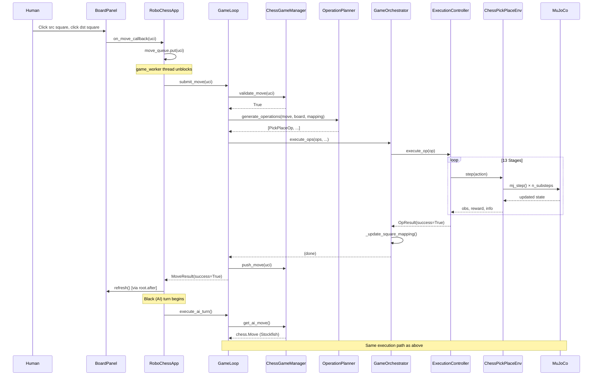

# 01 — High-Level Design

## Module Map

| Module | File(s) | Responsibility |
|--------|---------|----------------|
| Config | `src/config.py`, `src/settings/runtime.yaml` | Load, validate, and export all tunable runtime parameters |
| Exceptions | `src/exceptions.py` | Domain-specific exception hierarchy |
| Logging | `src/logging_utils.py` | Structured key=value event logging |
| Data Models | `src/models.py` | `GameSystems`, `MoveResult`, `GameState` containers |
| Chess Logic | `src/logic/chess_manager.py` | python-chess board + Stockfish engine lifecycle |
| Operation Planning | `src/logic/operation_planner.py` | Translate `chess.Move` → `[PickPlaceOp]` |
| MuJoCo Environment | `src/env/chess_pick_place_env.py` | Gym wrapper; physics stepping; gripper/piece API |
| Observation | `src/env/obs_wrapper.py` | Reconstruct 26D RL observation vector |
| Board Observer | `src/observation/board_observer.py` | Detect tipped/buried/displaced pieces |
| Execution Controller | `src/control/execution_controller.py` | 10-stage pick-and-place; delegates major transits to SAC |
| Runtime Guard | `src/runtime_guard.py` | Physical ↔ logical board agreement; freeze on error |
| Health Checks | `src/health_checks.py` | Pluggable check framework; 10 built-in checks |
| Bootstrap | `src/bootstrap.py` | One-shot system initialization into `GameSystems` |
| Game Runtime | `src/game_runtime.py` | Op dispatch; teleport; promotion swap |
| Game Loop | `src/game_loop.py` | Turn orchestration API consumed by the app |
| GUI | `src/gui/board_panel.py` | Tkinter board rendering and input |
| App | `src/app.py` | Thread management; main loop |

---

## Data Flow

### High-Level Sequence: One Full Turn



---

## Threading Model

```
Main Thread (Tkinter)                 Daemon Thread (game_worker)
─────────────────────                 ──────────────────────────
Tkinter mainloop()                    mujoco.viewer.launch_passive()
BoardPanel events                     GameLoop.submit_move() / execute_ai_turn()
root.after(0, callback)  ◄──────────  schedules GUI updates
                          move_queue  ◄── on_gui_move() puts UCI strings
                          stop_event  ◄── on_close() sets it
                          step_mode_event  ◄── GUI checkbox toggles
```

**Rules:**
- Never call Tkinter from the worker thread directly; always use `root.after(0, fn)`.
- Never call MuJoCo physics from the main thread; all physics lives in `game_worker`.
- `move_queue` is the only communication channel for moves (thread-safe `queue.Queue`).
- The daemon thread exits automatically when the main thread exits.

---

## Control Flow: Turn Cycle

```
game_worker():
│
├─ launch MuJoCo passive viewer
│
└─ loop while not stop_event and viewer running and game not over:
    │
    ├─ drain physics_step_queue (manual physics steps from GUI)
    │
    ├─ state = game_loop.get_state()
    │
    ├─ if WHITE turn:
    │   ├─ uci = move_queue.get(timeout=0.1)   # blocks 100ms
    │   ├─ if uci is None → step-mode AI trigger
    │   └─ else → submit_move(uci)
    │
    └─ if BLACK turn:
        ├─ if step_mode_event set → wait for None from queue
        └─ else → execute_ai_turn() immediately
```

---

## Key Abstractions

### `PickPlaceOp`
The atomic unit of physical work. One op = pick one piece from one square, place it on another square (or graveyard). All chess special moves decompose into sequences of `PickPlaceOp`s.

```
PickPlaceOp(
    target_square: str,   # where to pick from (e.g. "e2" or "white_graveyard")
    dest_square:   str,   # where to place (e.g. "e4" or "black_graveyard")
    piece_name:    str,   # MuJoCo body name (e.g. "w_pawn_1")
    is_capture:    bool,  # True if this op removes an enemy piece
    promotion:     int?,  # chess.QUEEN / ROOK / BISHOP / KNIGHT or None
)
```

### `GameSystems`
The runtime container. Passed by reference through the system. Created once at bootstrap. Contains every subsystem component.

```
GameSystems(
    mj_model, mj_data,       # MuJoCo model and data
    env,                      # ChessPickPlaceEnv
    rl_model,                 # loaded SAC model (stable_baselines3.SAC)
    manager,                  # ChessGameManager
    planner,                  # OperationPlanner
    controller,               # ExecutionController
    square_to_piece,          # dict[str, str]  "e2" → "w_pawn_1"
    arm_home_grip,            # np.ndarray [x,y,z] home position
    check_registry,           # RuntimeCheckRegistry
    captured_count,           # dict {"white": int, "black": int}
)
```

### `square_to_piece`
A mutable `dict[str, str]` mapping chess square names to MuJoCo body names. It is the bridge between the logical board (`python-chess`) and the physical scene. It is updated after every op execution. At turn boundaries, health checks verify it matches the board's piece map.

### `CheckHook` and `RuntimeCheck`
A named lifecycle point (enum) and a base class for validation logic. Checks register themselves for one or more hooks. The `RuntimeCheckRegistry` dispatches all registered checks at each hook point. Checks raise domain-specific exceptions on failure; the caller decides whether to freeze or recover.

---

## Key Architectural Decisions

### 1. Staged Execution (10 stages)
Rather than one monolithic "move piece" function, execution is broken into 10 discrete, named stages. Each stage has a clear goal, success criterion, and can be individually debugged. The stage state machine allows:
- Per-stage health checks (ARM_STAGE_START, ARM_STAGE_END)
- Clean retry logic (on pick failure, restart from PREHOVER_SRC — re-hover above the piece without travelling all the way home)
- Easy extension (add a new stage without touching others)

### 2. All Parameters in YAML
Every numeric constant used in the physics loop lives in `src/settings/runtime.yaml` and is exported from `src/config.py`. No magic numbers in source code. This enables:
- Tuning without code changes
- Schema validation at startup
- Clear documentation of what each value controls

### 3. Pure Physical Execution (No Teleportation)
The simulation relies entirely on the robot arm for all piece movements. Captures are decomposed into two physical operations: first, the arm removes the captured piece to the graveyard; second, the arm moves the attacking piece to the destination. Promotions similarly involve physically moving the pawn out and the spare piece in. No "magic" teleportation is used, ensuring a true robotics challenge.

### 4. Pluggable Health Checks
Runtime validation is separated from execution logic. Checks are registered against named hooks and run transparently. This means execution code stays clean and validation logic stays testable in isolation.

### 5. Board Mapping as the Bridge
`square_to_piece` is the single source of truth linking logical chess state to physical MuJoCo state. It is updated transactionally: mapping updates happen only after a successful op execution. If execution fails, the mapping is not updated, preserving consistency.

### 6. RL-Primary Execution: SAC Drives All Major Transits
The SAC policy is the **primary motion controller** for the arm, not a secondary advisor. For three of the four transit stages — PREHOVER_SRC (approach piece), LIFT_VERIFY (lift after grasping), and PREHOVER_DEST (carry to destination) — the RL model has **100% XYZ control**. The waypoint structure (via `env.set_target`) ensures the RL drives toward the correct intermediate goal rather than the final placement position. Scripted proportional control is used **only** for:
- DESCEND_SRC and DESCEND_DEST: the final ~3cm vertical descent where millimeter contact precision is required
- HOME_RESET, RELEASE_AND_CLEAR, SETTLE_AND_HOME: fixed-target motions where the RL provides no benefit

The gripper (finger actuators) is always managed by the scripted controller — the RL's gripper output dimension is zeroed and replaced by explicit stage commands.

### 7. Local RL Model, Relaxed Workspace Constraint
The policy workspace check (`_policy_compatibility_issues`) is **informational only**. It logs warnings but does not cause teleportation fallback by itself. Only hard reachability bound violations (outside `REACHABLE_X/Y/Z_MIN/MAX`) trigger a teleport fallback. This is appropriate because the local model was trained on a larger board.

---

## MuJoCo XML Design

The scene is defined in `src/assets/chess_world.xml`, which includes `fetch.xml`. Key design choices:

| Element | Design |
|---------|--------|
| Chess pieces | Each is a MuJoCo `body` with a `freejoint`, a visible mesh geom, and a **box** hitbox geom. Box hitboxes cannot roll on contact (unlike cylinders), matching the cube-trained policy's contact expectations. |
| Piece naming | `w_pawn_1` through `w_king`, `b_pawn_1` through `b_king`; spare promotion pieces as `w_spare_queen_1`, etc. |
| Piece collision | Box hitboxes enabled (`contype=1`); mesh geoms disabled by default (`contype=0`). Mesh geoms are visual only and are never used for contact resolution. |
| Piece damping | `dof_damping` is left at a physically realistic, low constant value. Natural mass, friction, and gravity keep pieces stable. |
| Board squares | 64 box geoms for the visual checkerboard; invisible `board_collision` box handles piece resting |
| Graveyard | Two platform geoms (white side, black side) for captured pieces |
| Robot control | Mocap body `robot0:mocap`; joints follow it via equality constraints |
| Collision masking | Robot geometry: `contype=2`; floor: `contype=4`; pieces use `conaffinity` bits to interact with floor but not robot body |

---

## Observation Vector (26D)

The RL policy expects the same observation space as `FetchPickAndPlace-v1`:

| Slice | Dim | Content |
|-------|-----|---------|
| `[0:3]` | 3 | Gripper site position (world XYZ) |
| `[3:6]` | 3 | Object (piece site) position (world XYZ) |
| `[6:9]` | 3 | Object position relative to gripper |
| `[9:11]` | 2 | Gripper finger joint positions |
| `[11:14]` | 3 | Object rotation (Euler angles) |
| `[14:17]` | 3 | Object linear velocity relative to gripper (scaled by dt) |
| `[17:20]` | 3 | Object angular velocity (scaled by dt) |
| `[20:23]` | 3 | Gripper site velocity (scaled by dt) |
| `[23:25]` | 2 | Gripper finger joint velocities (scaled by dt) |
| `[25]` | 1 | Remaining time feature (clipped to [0, 1]) |

`dt = n_substeps × model.opt.timestep`

---

## Error Handling Strategy

| Error type | Handling |
|------------|----------|
| Illegal chess move | Rejected immediately; `MoveResult(success=False)`; no physics |
| Stockfish unavailable | `AIEngineError` raised at startup; app won't start |
| Local model not found | `RLModelError` raised at bootstrap; app won't start |
| Stage failure (CLOSE/LIFT) | Retry up to 2 times from PREHOVER_SRC (re-hover above piece; avoids full home transit) |
| Stage failure (other) | Retract arm, return `OpResult(success=False)` |
| Physical placement miss | Detected by `_finalize_placement`; `OpResult(success=False)` |
| Health check violation | Exception propagates; `freeze_on_exception` holds viewer open |
| NaN in simulation state | `NumericalStabilityError` from `FiniteStateCheck` |
| Piece tipped/buried | `StabilityError` from `PieceObserverCheck` / `BoardObserver` |
| Fatal exception in worker | Logged; `freeze_on_exception`; GUI shown error dialog |
