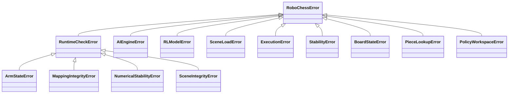
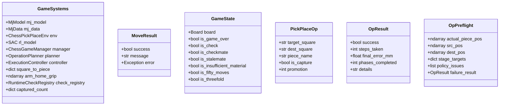
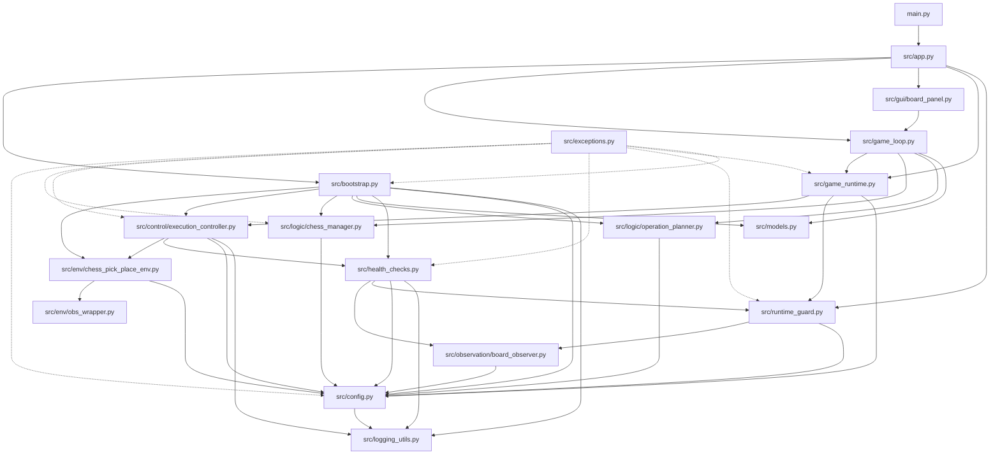
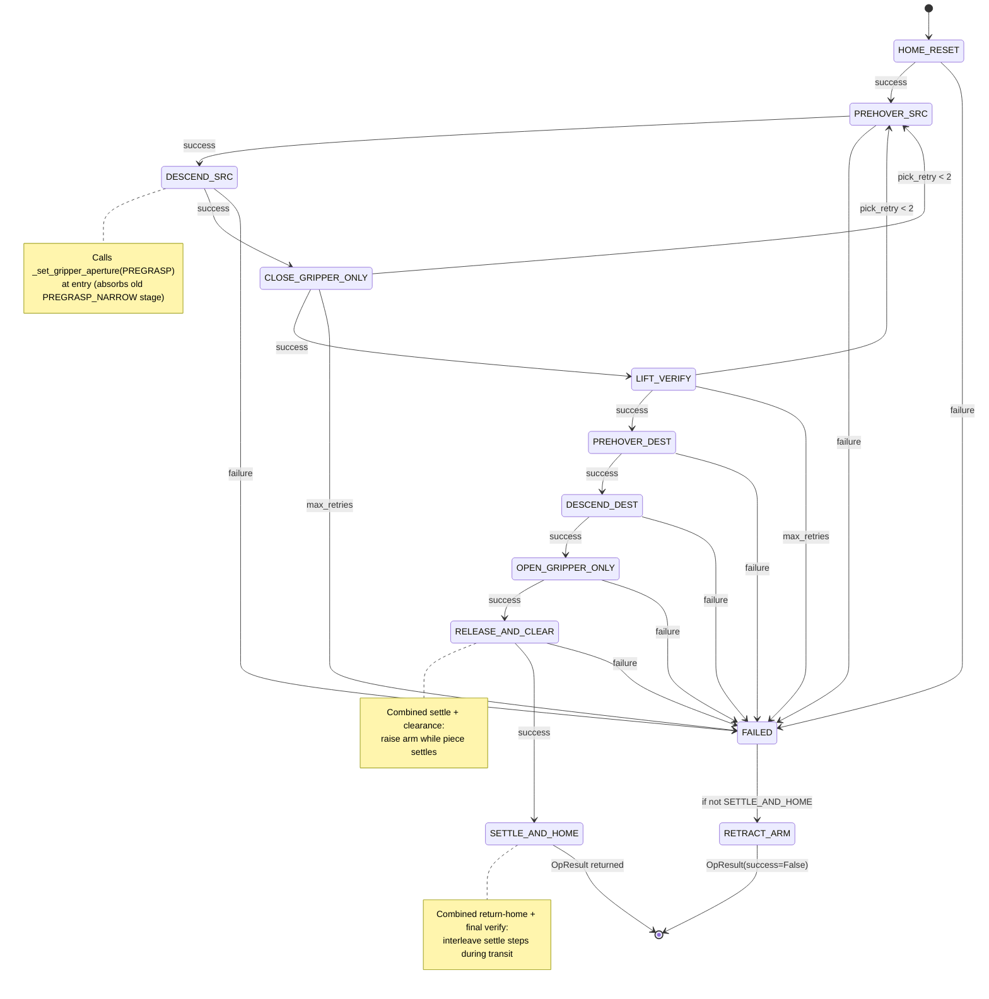
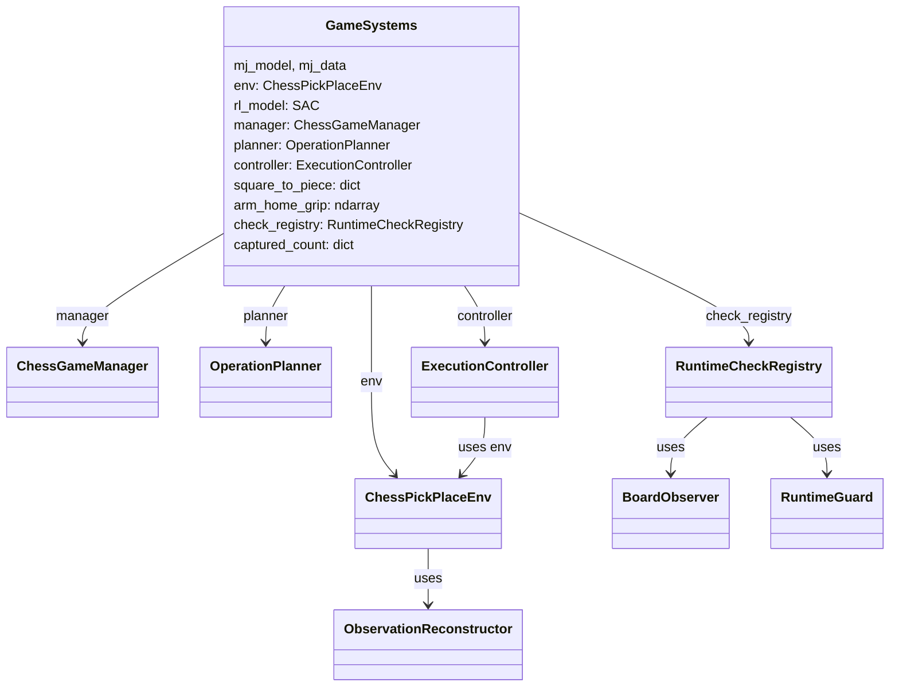

# 03 — Class Hierarchy and Structure

## Full Class Hierarchy

```
object
├── Exception
│   └── RoboChessError                          (src/exceptions.py)
│       ├── RuntimeCheckError
│       │   ├── ArmStateError
│       │   ├── MappingIntegrityError
│       │   ├── NumericalStabilityError
│       │   └── SceneIntegrityError
│       ├── AIEngineError
│       ├── RLModelError
│       ├── SceneLoadError
│       ├── ExecutionError
│       ├── StabilityError
│       ├── BoardStateError
│       ├── PieceLookupError
│       └── PolicyWorkspaceError
│
├── str + Enum
│   └── CheckHook                               (src/health_checks.py)
│
├── gym.Env
│   └── ChessPickPlaceEnv                       (src/env/chess_pick_place_env.py)
│
├── tk.Frame
│   └── BoardPanel                              (src/gui/board_panel.py)
│
├── Data classes (plain Python, no inheritance)
│   ├── GameSystems                             (src/models.py)
│   ├── MoveResult                              (src/models.py)
│   ├── GameState                               (src/models.py)
│   ├── PickPlaceOp                             (src/logic/operation_planner.py)
│   ├── OpResult                                (src/control/execution_controller.py)
│   └── OpPreflight                             (src/control/execution_controller.py)
│
├── Service classes (plain Python, no inheritance)
│   ├── ConfigManager                           (src/config.py)
│   ├── EventLogger                             (src/logging_utils.py)
│   ├── ChessGameManager                        (src/logic/chess_manager.py)
│   ├── OperationPlanner                        (src/logic/operation_planner.py)
│   ├── ObservationReconstructor                (src/env/obs_wrapper.py)
│   ├── BoardObserver                           (src/observation/board_observer.py)
│   ├── ExecutionController                     (src/control/execution_controller.py)
│   ├── RuntimeGuard                            (src/runtime_guard.py)
│   ├── SystemBootstrapper                      (src/bootstrap.py)
│   ├── GameOrchestrator                        (src/game_runtime.py)
│   ├── GameLoop                                (src/game_loop.py)
│   ├── RoboChessApp                            (src/app.py)
│   └── RuntimeCheckRegistry                    (src/health_checks.py)
│
└── RuntimeCheck (abstract base)                (src/health_checks.py)
    ├── SceneAssetsCheck
    ├── MappingIntegrityCheck
    ├── BoardAgreementCheck
    ├── ArmHomePoseCheck
    ├── RobotWorkspaceCheck
    ├── FiniteStateCheck
    ├── PieceObserverCheck
    ├── StageGoalReachabilityCheck
    ├── StageOutcomeCheck
    └── StageGripAttachmentCheck
```

---

## Exception Hierarchy (Mermaid)



---

## Data Model Class Diagram (Mermaid)



---

## Module Dependency Graph (Mermaid)



---

## Execution Stage State Machine (Mermaid)



**Retry logic**: `CLOSE_GRIPPER_ONLY` and `LIFT_VERIFY` failures loop back to `PREHOVER_SRC` (not HOME_RESET) up to 2 times. The arm re-hovers above the source piece and retries the descent without travelling all the way home. On retry, the actual piece position is re-read and stage targets are rebuilt.

---

## CheckHook Dispatch Table

```mermaid
classDiagram
    class RuntimeCheckRegistry {
        +run(hook, context)
    }

    class SceneAssetsCheck {
        hooks: POST_SCENE_LOAD
    }
    class MappingIntegrityCheck {
        hooks: PROGRAM_START, TURN_START, TURN_END
    }
    class BoardAgreementCheck {
        hooks: PROGRAM_START, TURN_START, TURN_END
    }
    class ArmHomePoseCheck {
        hooks: PROGRAM_START, TURN_START, TURN_END
    }
    class RobotWorkspaceCheck {
        hooks: PROGRAM_START, TURN_START, TURN_END
    }
    class FiniteStateCheck {
        hooks: POST_SCENE_LOAD, PROGRAM_START, TURN_START, TURN_END, ARM_STAGE_START, ARM_STAGE_END
    }
    class PieceObserverCheck {
        hooks: PROGRAM_START, TURN_START, TURN_END
    }
    class StageGoalReachabilityCheck {
        hooks: ARM_STAGE_START
    }
    class StageOutcomeCheck {
        hooks: ARM_STAGE_END
    }
    class StageGripAttachmentCheck {
        hooks: ARM_STAGE_END
    }

    RuntimeCheckRegistry --> SceneAssetsCheck
    RuntimeCheckRegistry --> MappingIntegrityCheck
    RuntimeCheckRegistry --> BoardAgreementCheck
    RuntimeCheckRegistry --> ArmHomePoseCheck
    RuntimeCheckRegistry --> RobotWorkspaceCheck
    RuntimeCheckRegistry --> FiniteStateCheck
    RuntimeCheckRegistry --> PieceObserverCheck
    RuntimeCheckRegistry --> StageGoalReachabilityCheck
    RuntimeCheckRegistry --> StageOutcomeCheck
    RuntimeCheckRegistry --> StageGripAttachmentCheck
```



---

## `GameSystems` Component Wiring (Mermaid)



---

## Observation Vector Layout

```
Index  Dim  Feature
─────  ───  ───────────────────────────────────────────────────────
 0–2    3   Gripper site XYZ (world frame)
 3–5    3   Target piece site XYZ (world frame)
 6–8    3   Piece position relative to gripper (piece_pos - grip_pos)
 9–10   2   Gripper finger joint positions [l, r]
11–13   3   Piece orientation (Euler angles from rotation matrix)
14–16   3   Piece linear velocity relative to gripper (scaled by dt)
17–19   3   Piece angular velocity (scaled by dt)
20–22   3   Gripper site linear velocity (scaled by dt)
23–24   2   Gripper finger joint velocities (scaled by dt)
   25   1   Remaining time feature in [0, 1]
─────  ───
Total: 26 dimensions, dtype float32
```

`dt = n_substeps × model.opt.timestep`

---

## Action Space

The policy outputs a 4D action vector: `[dx, dy, dz, gripper]`.

| Dim | Meaning | Range | Applied as |
|-----|---------|-------|-----------|
| 0 | X displacement | [-1, 1] | `dx × ACTION_SCALE` added to mocap_pos |
| 1 | Y displacement | [-1, 1] | `dy × ACTION_SCALE` added to mocap_pos |
| 2 | Z displacement | [-1, 1] | `dz × ACTION_SCALE` added to mocap_pos |
| 3 | Gripper | [-1, 1] | Mapped to finger actuator targets |

The gripper dim is unused in the direct `step()` path when `gripper_target` is specified explicitly by the controller.

---

## `square_to_piece` Mapping Lifecycle

```
Bootstrap
  └─ initialize_square_to_piece()
       └─ Scans all bodies, computes file/rank from XY position
       └─ Populates square_to_piece = {"e2": "w_pawn_5", ...}

Per PickPlaceOp
  ├─ Before execution: square_to_piece read for piece lookup
  └─ After execution: _update_square_mapping()
       ├─ Graveyard → pop target_square entry
       └─ Normal move → move entry from target_square to dest_square

Per Promotion
  └─ square_to_piece[dest_square] = spare_piece_name

Health checks at TURN_START / TURN_END
  └─ MappingIntegrityCheck: no duplicates, count matches board
  └─ BoardAgreementCheck: positions match expected positions
  └─ ArmHomePoseCheck: arm at home before and after each turn
  └─ RobotWorkspaceCheck: gripper within reachability bounds
  └─ FiniteStateCheck: no NaN/Inf in simulation state
  └─ PieceObserverCheck: pieces upright, not buried, not displaced
```
